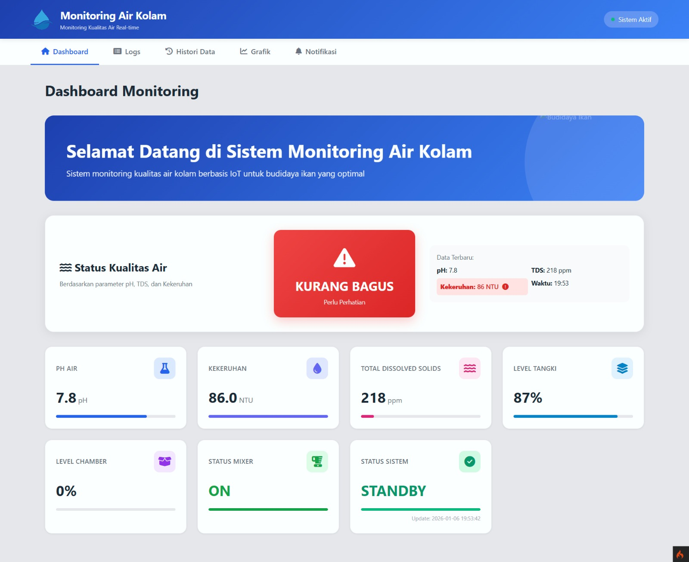

# 🌊 MOAQ - Smart Water Monitoring System
> **Real-time Monitoring & Analytics for Interactive Fish Pond Environments**

[](https://codeigniter.com/)
[](https://www.php.net/)
[](LICENSE)
[](https://www.iana.org/time-zones)

MOAQ adalah platform IoT Pintar yang dirancang untuk menjaga kualitas air kolam secara otomatis. Dengan integrasi hardware ESP32, data dari lapangan diproses secara cerdas untuk memberikan wawasan real-time bagi pembudidaya.

---

## 📸 Preview Home


---

## ✨ Fitur Unggulan

### 📊 Visualisasi Cerdas (Smart Graph Engine)
*   **Dual Y-Axis Display:** Memisahkan skala pH/Turbidity dengan TDS (ppm) untuk visualisasi yang akurat.
*   **Smart Downsampling:** Query otomatis yang menyaring hingga 10.000 data mentah menjadi 1.000 titik sampel merata untuk menjaga performa browser.
*   **Accurate Time Range:** Filter rentang waktu (Latest, 1 Jam, 24 Jam) yang sinkron dengan waktu database menggunakan Native SQL.

### 🛡️ Integritas Data (Anomaly Detection)
*   **Sanity Check Logic:** Sensor yang error atau noise (seperti lonjakan nilai hingga 200rb) otomatis dibersihkan di sisi server sebelum disimpan.
*   **Dynamic Water Quality Status:** Klasifikasi otomatis "Bagus" atau "Kurang Bagus" berdasarkan ambang batas parameter standar.

### 🔔 Notifikasi & Kesehatan Sistem
*   **Auto-Alert System:** Deteksi anomali real-time yang langsung mengirimkan notifikasi peringatan jika parameter keluar dari set-point.
*   **System Health Check:** Otomatis menandai status "Offline" jika perangkat di kolam berhenti mengirimkan data lebih dari 5 menit.

---

## 🛠 Tech Stack

*   **Framework:** [CodeIgniter 4](https://codeigniter.com/)
*   **Frontend:** Tailwind CSS, FontAwesome 6
*   **Chart Engine:** Chart.js 4.x
*   **Database:** MySQL / MariaDB
*   **IoT Interface:** RESTful API (JSON Based)

---

## 🚀 Instalasi Cepat

1.  **Clone repositori:**
    ```bash
    git clone https://github.com/Aufazahron/moaq.git
    cd moaq
    ```
2.  **Instal dependensi:**
    ```bash
    composer install
    ```
3.  **Konfigurasi Database:**
    Salin `env` menjadi `.env` dan sesuaikan pengaturan database Anda:
    ```env
    database.default.database = monitoring_kolam
    database.default.username = root
    database.default.password = 
    app.appTimezone = Asia/Jakarta
    ```
4.  **Siapkan Database:**
    Import file `.sql` terbaru yang ada di folder `database/`.
5.  **Jalankan aplikasi:**
    ```bash
    php spark serve
    ```

---

## 📡 Alur Data (API)

Hardware ESP32 mengirim data ke endpoint berikut:
`POST /api/sensor/receive`

**Payload Format:**
```json
{
  "sensors": {
    "ph": 7.2,
    "tds": 420,
    "turb": 15.5,
    "tank": "85%",
    "chamber": "10%"
  }
}
```

---

## 👨‍💻 Tim Software
Aplikasi ini dikembangkan oleh **Tim Software MOAQ** yang berfokus pada:
1.  **Backend Specialist:** Optimasi query, API Security, & Data Ingestion.
2.  **Frontend & UX Developer:** Real-time polling, Interactive Visualization, & Responsive Dashboard.

---

## 📄 Lisensi
Di bawah lisensi **MIT**. Gunakan dengan bijak untuk kemajuan perikanan Indonesia! 🐟🇮🇩

---
*Created with ❤️ by MOAQ Team*
