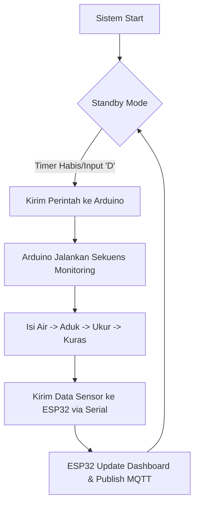
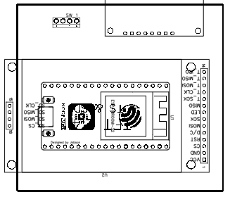
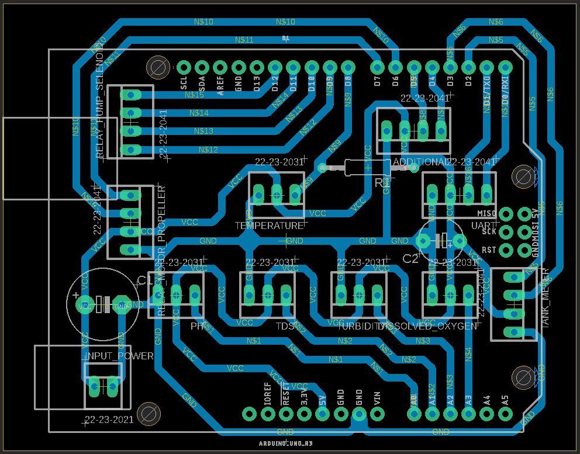

# 🌊 Smart Water Monitoring System (UAS SENSOR)

[](https://www.arduino.cc/) 
[](https://www.espressif.com/)
[](https://www.emqx.com/)
[](https://arduinojson.org/)

Sebuah sistem monitoring kualitas air dual-controller yang interaktif, dirancang untuk memantau pH, Turbiditas (Kekeruhan), dan TDS (Total Dissolved Solids) secara real-time dengan kendali otomatis dan sinkronisasi cloud.

---

## 🚀 Fitur Utama

-   **Dual-Controller Architecture**: Pemisahan tugas antara **Master (ESP32)** untuk UI/Jaringan dan **Slave (Arduino Uno)** untuk kontrol sensor/aktuator.
-   **Interactive Dashboard**: Tampilan TFT LCD 2.4" dengan *Real-time Charts* (pH, Turb, TDS).
-   **Cloud Integration**: Konektivitas MQTT (SSL/TLS) untuk pemantauan jarak jauh.
-   **Smart Automation**: Kontrol otomatis solenoid, pompa, dan pengaduk untuk siklus pengukuran yang konsisten.
-   **Highly Configurable**: Pengaturan interval dan durasi monitoring langsung dari perangkat melalui 4x4 Keypad.
-   **Calibration Engine**: Algoritma kalibrasi sensor terintegrasi untuk akurasi data yang lebih baik.

---

## 🛠️ Arsitektur Perangkat Keras

### 🎮 Main Controller (ESP32)
*Berperan sebagai otak komunikasi dan antarmuka pengguna.*

| Komponen | Kegunaan |
| :--- | :--- |
| **NodeMCU-32S** | Prosesor Utama, WiFi, & MQTT Client |
| **TFT LCD 2.4" ILI9341** | Dashboard Visual & Menu Interaktif |
| **Keypad 4x4** | Input Konfigurasi & Navigasi Menu |

### 📟 Secondary Controller (Arduino Uno)
*Berperan sebagai eksekutor sensor dan aktuator.*

| Komponen | Kegunaan |
| :--- | :--- |
| **Sensor pH** | Mengukur tingkat keasaman air |
| **Sensor TDS** | Mengukur kristal mineral terlarut (Kualitas Kemurnian) |
| **Sensor Turbidity** | Mengukur tingkat kekeruhan air |
| **HC-SR04 x2** | Level Air (Tangki Aquarium & Chamber) |
| **Relay / Actuators** | Solenoid (In/Out), Pompa, & Dinamo Pengaduk |

---

## 📂 Struktur Folder

```text
Sensor/
├── MainController-ESP32/       # Source code ESP32 (Master)
│   ├── MainController-ESP32.ino
│   └── PCB/                    # Desain PCB & Skematik ESP32
├── SecController-ArduinoUno/   # Source code Arduino (Slave)
│   ├── SecController-ArduinoUno.ino
│   └── PCB/                    # Desain PCB & Skematik Arduino
├── schematics.fzz              # File Fritzing (Full System)
└── schematics.png              # Gambar Diagram Skematik
```

---

## 📡 Protokol Komunikasi Serial

Kedua controller berkomunikasi melalui **Serial (115200 Baud)** dengan format berikut:

### 📤 Master ke Slave (Commands)
- `Monitoring:{durasi}` : Memerintahkan Arduino untuk memulai siklus monitoring.
- `SET:{interval}:{durasi}` : Sinkronisasi konfigurasi dari UI ke backend.

### 📥 Slave ke Master (Data)
- `pH,Turb,TDS,LvlCham,LvlAqua,Detik,Status`
  - Contoh: `7.2,15.5,230,85,90,12,MENGUKUR`
- `[STATUS] {Pesan}` : Log status untuk ditampilkan di dashboard.
- `Monitoring:ready` : Sinyal bahwa Arduino telah menyelesaikan siklus atau telah standby.

---

---

## 🔄 Alur Logika Sistem



---

## ⌨️ Kontrol Navigasi (Keypad)

Sistem ini menggunakan navigasi berbasis keypad yang intuitif:

-   **[A]**: Kembali ke Dashboard (Home).
-   **[B]**: Masuk ke Menu Utama.
-   **[D]**: Tombol Power (Start/Stop Monitoring).
-   **[2] & [8]**: Navigasi Atas/Bawah pada menu.
-   **[#]**: OK / Enter / Confirm.
-   **[*]**: Cancel / Back.
-   **[C]**: Mengosongkan Input Buffer.

---

## 🛠️ Instalasi & Pengoperasian

1.  **Hardware**: Hubungkan Pin TX/RX antara ESP32 dan Arduino Uno (Gunakan Logic Level Shifter jika perlu).
2.  **Library**: Instal library berikut pada Arduino IDE:
    -   `TFT_eSPI` (Konfigurasi User_Setup.h sesuai pinout PCB)
    -   `PubSubClient` (Koneksi MQTT)
    -   `ArduinoJson` (Parsing Data)
    -   `Keypad` library 
3.  **Konfigurasi**: Sesuaikan `ssid` dan `password` WiFi pada `MainController-ESP32.ino`.
4.  **MQTT**: Update `mqtt_server` dan kredensial EMQX Anda.
5.  **Upload**: Flash masing-masing controller dengan source code yang tersedia.

---

## 🖼️ Dokumentasi Visual

| Layout PCB ESP32 | Layout PCB Arduino Uno |
| :---: | :---: |
|  |  |

---

## 📝 Catatan Pengembang
Proyek ini dikembangkan sebagai bagian dari **UAS SENSOR**. Sistem menggunakan protokol serial custom untuk komunikasi antar controller dengan format CSV yang diparsing oleh ESP32 untuk visualisasi data.

---

<p align="center">
  <b>Developed by moaq with ❤️</b>
</p>
